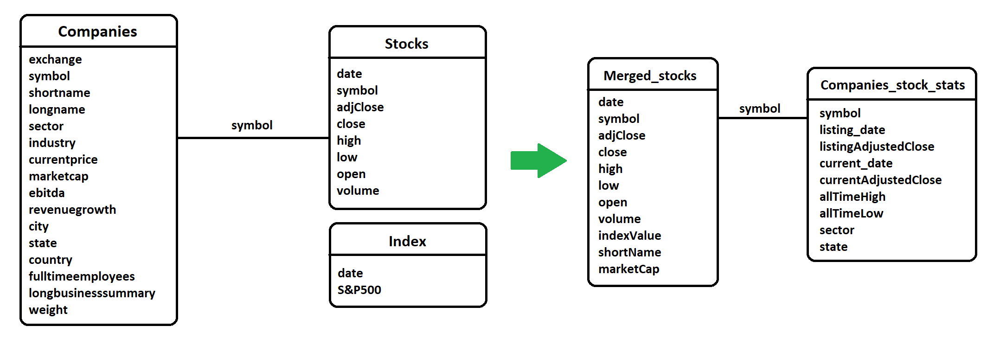
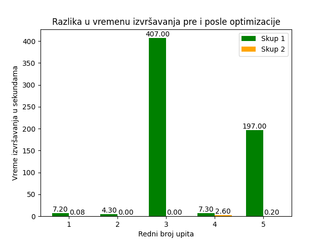

# MongoDB-Projekat

**Tema:** Analiza indeksa S&P 500

**Student:** Vasilije Zeković IN 4/2020

## Opis skupa podataka
Skup podataka [S&P 500 stocks](https://www.kaggle.com/datasets/andrewmvd/sp-500-stocks) obuhvata informacije o indeksu na berzi. To je indeks koji predstavlja 500 najvećih kompanija u Sjedinjenim Američkim Državama i on oponaša, prati i objedinjuje rast tržišne vrednosti svih tih kompanija. Podaci se nalaze u 3 skupa; skup podataka companies sadrži 16 kolona i 503 uzorka i on predstavlja opšte informacije o kompaniji kao što su: naziv, država, sektor i industrija kojom se bave, trenutna cena, tržišna kapitalizacija, rast prihoda i slično.

Drugi skup podataka pod nazivom index sadrži 2518 uzoraka i 2 obeležja i on predstavlja agregirane vrednosti indeksa na tržištu koje su se kretale od 2014. pa do 2024. godine na dnevnom nivou, dok treći skup podataka pod nazivom stocks sadrži najviše podataka, u 1,8 miliona uzoraka koji su sačinjeni od 8 obeležja predstavljena je svaka pojedinačna kompanija koja sačinjava indeks S&P 500, odnosno za svaku kompaniju prikazana je cena njenih akcija na dnevnom nivou od momenta izlistavanja na berzi pa sve do 2024. godine, kao i "volume" koji predstavlja količinu indeksa kojom se trgovalo, a takođe i razne informacije bitne za trgovca berze kao što su: cena akcije pri otvaranju berze, na zatvaranju, najmanja cena tog dana, najveća i slično.

Tabela _index_:
* Date – datum kada je uzorkovana vrednost indeksa
* S&P500 – vrednost indeksa

Tabela _companies_:
* Exchange - naziv menjačnice
* Symbol - jedinstvena oznaka kompanije
* Shortname - kraća verzija naziva kompanije
* Longname - duža verzija naziva kompanije
* Sector - klasifikacija kompanije na osnovu sektora kom pripada kompanija
* Industry - klasifikacija kompanije na osnovu industrije kojoj pripada kompanija
* Currentprice - poslednja vrednost akcije, određena na dan preuzimanja skupa podataka, odnosno 24.5.2024.
* Marketcap - tržišna vrednost kompanije u USD (broj akcija x tržišna vrednost akcije)
* Ebitda - zarada pre kamata, poreza, amortizacije i deprecijacije
* Revenuegrowth - porast prihoda izražen u procentima
* City - naziv grada u kom se nalazi sedište kompanije
* State - naziv savezne države u kojoj se nalazi sedište kompanije
* Country -  naziv zemlje u kojoj se nalazi sedište kompanije
* Fulltimeemployees - broj radnika zaposlenih za stalno
* Longbusinesssumary - malo duži opis kompanije
* Weight - udeo kompanije u vrednosti indexa

Tabela _stocks_:
* Date - datum kada je uzorkovana vrednost akcije kompanije.
* Symbol - jedinstvena oznaka kompanije
* Adj close (adjusted closing price) -  slično kao cena akcije pri zatvaranju berze, ali uzima u obzir isplatu dividendi i povećanje/smanjenje broja akcija nakon zatvaranja berze
* Close - cena akcije kompanije nakon zatvaranja berze
* High - najviša cena akcije tokom dana 
* Low - najniža cena akcije tokom dana
* Open - cena akcije prilikom otvaranja berze
* Volume - količina akcija kojom se trgovalo u toku jednog dana

## Realizacija projekta
Ideja projekta jeste da se na osnovu velikih skupova podataka kreira pet kompleksnih upita koji će zahvaljujući svojoj prirodi izazvati drastično narušavanje performansi tokom izvršavanja. Nakon toga, potrebno je razumeti problematiku i zahvaljujući tome primeniti različite načine optimizacije, poput restrukturiranja šeme i primene indeksa. 

Način na koji je šema restrukturirana nakon donetih odluka u vezi optimizacije.

### Upiti
U sklopu realizacije projekta, cilj je odgovoriti na narednih 10 pitanja: 
1. Prikazati prosečne cene pri otvaranju i zatvaranju prodaje akcija po kvartalima za kompaniju Apple od datuma izlistavanja kompanije na berzi. - [Rešenje](upit_1/README.md)
2. U akcije koje kompanije se trebalo ulagati 1. juna 2010. godine kako bi se postigao najveći ROI na datum 24. maj 2024. godine. - [Rešenje](upit_2/README.md)
3. Za svaki sektor prikazati po jednu kompaniju koja je imala najveći skok cena akcija od početka 2024. pa do dana poslednjeg uzorkovanja. - [Rešenje](upit_3/README.md)
4. Predstavi prosečan volume po danu u odnosu na sve akcije u poređenju sa S&P 500 indeksom tokom januara 2019. godine. - [Rešenje](upit_4/README.md)
5. Izračunati koliki skok vrednosti cena akcija su imale kompanije tokom 2024. godine i zatim top 30 kompanija razvrstati prema industrijama, i predstaviti broj kompanija po industriji. - [Rešenje](upit_5/README.md)

### Grafik uporednih rezultata

**Napomena:** Za izradu svih grafika je korišćen Metabase.

