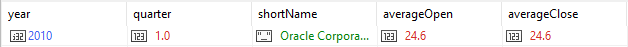
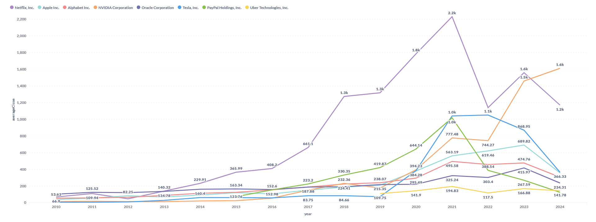
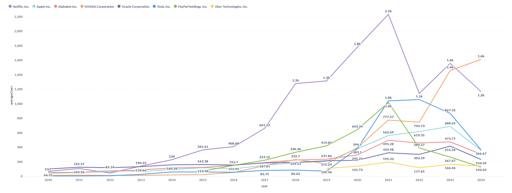
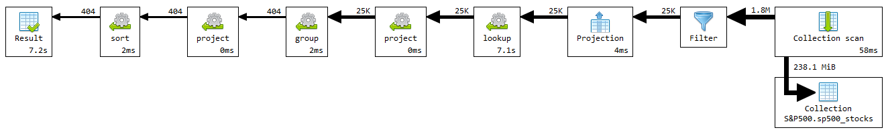
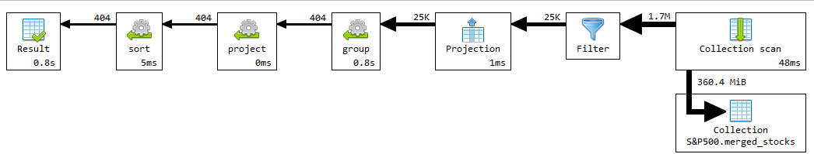
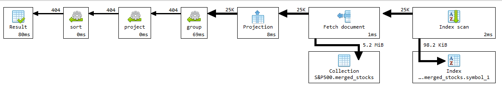

# Upit 1 - Prikazati prosečne cene pri otvaranju i zatvaranju prodaje akcija po kvartalima za kompaniju Apple od datuma izlistavanja kompanije na berzi.

## Izvršavanje upita

```
db.sp500_stocks.aggregate([
    {
        $match: {
            "Symbol": {$in: ["AAPL", "GOOGL", "ORCL", "PYPL", "NVDA", "UBER", "NFLX", "UBER", "PYPL", "TSLA"]},
            "Open": { $ne: null }
        }
    },
    {
        $lookup: {
            from: "sp500_companies", 
            localField: "Symbol",
            foreignField: "Symbol",   
            as: "company_details"    
        }
    },
    {
      $unwind: "$company_details"  
    },
    {
        $project: {
            year: { $year: "$Date" },
            quarter: { $ceil: { $divide: [{ $month: "$Date" }, 3] } },
            Open: 1,
            Close: 1,
            shortname: "$company_details.Shortname"
        }
    },
    {
        $group: {
            _id: {
                year: "$year",
                quarter: "$quarter",
                shortname: "$shortname",
            },
            averageOpen: { $avg: "$Open" },
            averageClose: { $avg: "$Close" }
        }
    },
    {
        $project: {
            _id: 0,
            year: "$_id.year",
            quarter: "$_id.quarter",
            shortName: "$_id.shortname",
            averageOpen: { $round: ["$averageOpen", 2] },
            averageClose: { $round: ["$averageClose", 2] },
        }
    },
    {
        $sort: {
            "year": 1,
            "quarter": 1
        }
    },
])
```

### Primer rezultata upita:


### Grafik upita br. 1 - Average close


### Grafik upita br. 1 - Average open


## Vreme izvršavanja upita br. 1 pre optimizacije

Kolekciju companies proširiti poljem kada je kompanija po prvi put izlistana na berzi. Imaće značajnog uticaja na većinu upita, jer je to vrlo bitan podatak, od koga dosta zavisi određivanje strategije izvršavanja upita, a i performanse posledično. Takođe ideja je da se pri restruktuiranju odbace svi dokumenti sa null vrednostima za cene akcija, jer je zaključak da su beskorisni.



Glavni problem upita je što se izvrašava etapa lookup, najbolje rešenje je da se iz kolekcije kompanija polje shortName prebaci u stocks, jer se došlo do zaključka da se naknadnim korišćenjem samo indeksa nad poljem symbol iz kolekcije companies ne bi značajnije dobilo na performansama, što je i očekivano, jer je kolekcija companies svakako mala. Upotrebom samo indeksa, lookup se smanji na svega 2,5 s (~3x). 
Biće poboljšan primarno restruktuiranjem kolekcije stocks.

## Izvršavanje upita br. 1 nakon izmene šeme:
```
db.merged_stocks.aggregate([
    {
        $match: {
            "symbol": {$in: ["AAPL", "GOOGL", "ORCL", "PYPL", "NVDA", "UBER", "NFLX", "UBER", "PYPL", "TSLA"]}
        }
    },
    {
        $project: {
            year: { $year: "$date" },
            quarter: { $ceil: { $divide: [{ $month: "$date" }, 3] } },
            open: 1,
            close: 1,
            shortname: 1
        }
    },
    {
        $group: {
            _id: {
                year: "$year",
                quarter: "$quarter",
                shortname: "$shortname",
            },
            averageOpen: { $avg: "$open" },
            averageClose: { $avg: "$close" }
        }
    },
    {
        $project: {
            _id: 0,
            year: "$_id.year",
            quarter: "$_id.quarter",
            shortname: "$_id.shortname",
            averageOpen: { $round: ["$averageOpen", 2] },
            averageClose: { $round: ["$averageClose", 2] },
        }
    },
    {
        $sort: {
            "year": 1,
            "quarter": 1
        }
    },
])
```
## Vreme izvršavanja upita br. 1 pre upotrebe indeksa i nakon izmene šeme


Poboljšan primarno restruktuiranjem kolekcije stocks.

## Vreme izvršavanja upita br. 1 nakon upotrebe indeksa i nakon izmene šeme


Upotrebljen je indeks nad obeležjem symbol kolekcije stocks. Ako se napravi kompozitni indeks symbol+shortname dobije se isto ubrzanje uz veći broj korišćenja samog indeksa tokom izvršavanja upita.
