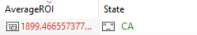
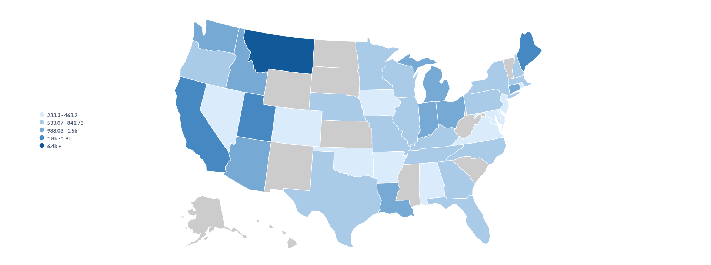
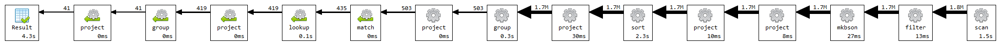
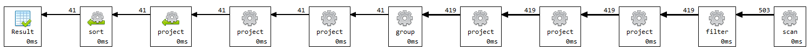

# Upit 2 - U akcije koje kompanije se trebalo ulagati 1. juna 2010. godine kako bi se postigao najveći ROI na datum 24. maj 2024. godine.

## Izvršavanje upita

```
db.sp500_stocks.aggregate([
    {
        "$match": {
            "Adj Close": {
                "$ne": null
            }
        }
    },
    {
        "$sort": {
            "Symbol": 1,
            "Date": 1
        }
    },
    {
        "$group": {
            "_id": "$Symbol",
            "firstClose": { "$first": "$Adj Close" },
            "firstDate": { "$first": "$Date" }, 
            "lastClose": { "$last": "$Adj Close" }
        }
    },
    {
        "$match": {
            "$expr": {
                "$eq": [
                    "$firstDate",
                    {
                        "$dateFromString": {
                            "dateString": "2010-01-04T00:00Z"
                        }
                    }
                ]
            }
        }
    },
    {
        "$lookup": {
            "from": "sp500_companies",
            "localField": "_id",
            "foreignField": "Symbol",
            "as": "company_info"
        }
    },
    {
        "$unwind": "$company_info"
    },
    {
        "$match": {
            "company_info.State": { "$ne": null }
        }
    },
    {
        "$project": {
            "State": "$company_info.State", 
            "ROI": { 
                "$round": [
                    {
                        "$multiply": [
                            {
                                "$divide": [
                                    { "$subtract": ["$lastClose", "$firstClose"] },
                                    "$firstClose"
                                ]
                            },
                            100
                        ]
                    }, 2
                ]
            },
        }
    },
    {
        "$group": {
            "_id": "$State",
            "AverageROI": { "$avg": "$ROI" }
        }
    },
    {
        "$project": {
            "_id": 0,
            "State": "$_id",
            "AverageROI": 1
        }
    }
]);
```
### Primer rezultata upita


### Grafik upita br. 2


## Vreme izvršavanja upita br. 2 pre optimizacije


Problem predugačkog izvršavanja etape scan će biti rešen upotrebom indeksa nad poljem date za koje će se ispostaviti da i u drugim upitima izaziva pad performansi, što je pozitivno, jer se jednim indeksom ubrzava grupa upita. Treba napomenuti da postoji još argumenata za uvođenjem indeksa nad tim poljem, priroda podataka je takva da se operacije modifikacije neće izvršavati, operacije brisanja još manje, a operacije upisa retko uz to je indeks nad date prilično selektivan. Drugi zastoj u performansama kod etape sort nastaje usled nepostojanja indeksa nad symbol i date (rastući poredak), stoga prvi zastoj i drugi zastoj bi se rešio upotrebom kompozitnog indeksa, pri čemu se pazi na strukturu tako da se može koristiti sem ovog i u drugim upitima. Bila je ideja takođe i da po defaultu budu sortirani dokumenti kao što i jesu tako importovani, ali MongoDB ne podržava sortiranost. Nažalost, indeksi su uspeli smanjiti vreme na svega 2s (~2x). Stoga je zaključak da se primeni drugačiji pristup. Odlučeno je da se kreira kolekcija companies_stock_stats u kojoj će se nalaziti simbol kompanije, datum izlistavanja na berzi, datum poslednjeg uzorkovanja cena akcija, različite vrednosti cene akcija za ta dva datuma, kao i minimalna i maksimalna vrednost cene akcija ikada.
Biće poboljšan primarno kreiranjem nove kolekcije.

## Izvršavanje upita br. 2 nakon izmene šeme
```
db.companies_stock_stats.aggregate([
    {
        "$match": {
          "$and": [
            {
              "$expr": {
                "$eq": [
                  "$listingDate",
                  {
                    "$dateFromString": {
                      "dateString": "2010-01-04T00:00Z"
                    }
                  }
                ]
              }
            },
            {
              "state": {
                "$ne": null
              }
            }
          ]
        }
    },
    {
        $project: {
            "State": "$state",
            "firstClose": "$listingAdjustedClose",
            "lastClose": "$currentAdjustedClose",
            "ROI": {
                "$round": [
                    {
                        "$multiply": [
                            {
                                "$divide": [
                                    { "$subtract": ["$currentAdjustedClose", "$listingAdjustedClose"] },
                                    "$listingAdjustedClose"
                                ]
                            },
                            100
                        ]
                    },
                    2
                ]
            }
        }
    },
    {
        $group: {
            "_id": "$State",
            "AverageROI": { "$avg": "$ROI" }
        }
    },
    {
        $project: {
            "_id": 0,
            "State": "$_id",
            "AverageROI": 1
        }
    },
    {
        $sort: {
            "AverageROI": -1
        }
    }
]);
```
## Vreme izvršavanja upita br. 2 pre upotrebe indeksa i nakon izmene šeme
Poboljšan primarno kreiranjem nove kolekcije.



## Vreme izvršavanja upita br. 2 nakon upotrebe indeksa i nakon izmene šeme
Nema potrebe za indeksom, dobija se par milisekundi duže izvršavanje sa indeksom.
