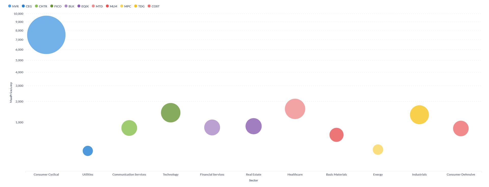

# Upit 3 - Za svaki sektor prikazati po jednu kompaniju koja je imala najveći skok cena akcija od početka 2024. pa do dana poslednjeg uzorkovanja.

## Izvršavanje upita

```
db.sp500_stocks.aggregate([
    {
        "$match": {
            "Adj Close": {
                        "$ne": null
            }
        }
    },
    {
        $lookup: {
            from: "sp500_companies",
            localField: "Symbol",
            foreignField: "Symbol",
            as: "company_details"
        }
    },
    {
        $unwind: "$company_details"
    },
    {
        $group: {
            _id: "$Symbol",
            Sector: { $first: "$company_details.Sector" },
            minPrice: { $min: "$Adj Close" },
            maxPrice: { $max: "$Adj Close" }
        }
    },
    {
        $project: {
            Symbol: "$_id",
            Sector: 1,
            PriceJump: { $subtract: ["$maxPrice", "$minPrice"] }
        }
    },
    {
        $sort: { "PriceJump": -1 }
    },
    {
        $group: {
            _id: "$Sector",
            Company: { $first: "$Symbol" },
            MaxPriceJump: { $first: "$PriceJump" }
        }
    },
    {
        $project: {
            _id: 0,
            Sector: "$_id",
            Company: 1,
            MaxPriceJump: 1
        }
    }
])
```
### Primer rezultata upita


### Grafik upita br. 3


## Vreme izvršavanja upita br. 3 pre optimizacije


Lookup kao etapa ne postoji nakon optimizacije već se čitava logika ovog upita obavlja o novonastaloj kolekciji companies_stock_stats.  

Biće poboljšan primarno kreiranjem nove kolekcije.

## Izvršavanje upita br. 3 nakon izmene šeme
```
db.companies_stock_stats.aggregate([
    {
        $project: {
            symbol: 1,
            sector: 1,
            PriceJump: { $subtract: ["$allTimeHigh", "$allTimeLow"] }
        }
    },
    {
        $sort: { "PriceJump": -1 }
    },
    {
        $group: {
            _id: "$sector",
            Company: { $first: "$symbol" },
            MaxPriceJump: { $first: "$PriceJump" }
        }
    },
    {
        $project: {
            _id: 0,
            Sector: "$_id",
            Company: 1,
            MaxPriceJump: 1
        }
    }
]);
```
## Vreme izvršavanja upita br. 3 pre upotrebe indeksa i nakon izmene šeme

Poboljšan primarno kreiranjem nove kolekcije.


## Vreme izvršavanja upita br. 3 nakon upotrebe indeksa i nakon izmene šeme
Iako je povećanje performansi minorno, svega 2-3 ms, ipak je uveden index. U pitanju je kompozitni indeks nad poljima listing_date i state, jer se nad njima vrši etapa match.


