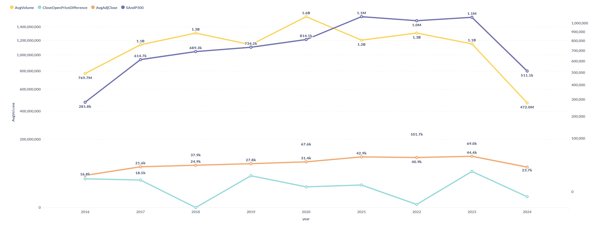
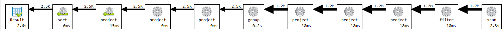

# Upit 4 - Predstavi prosečan volume po danu u odnosu na sve akcije u poređenju sa S&P 500 indeksom tokom januara 2019. godine.

## Izvršavanje upita

```
db.sp500_stocks.aggregate([
    {
        "$match": {
          "$and": [
            {
              "$expr": {
                "$gte": [
                  "$Date",
                  {
                    "$dateFromString": {
                      "dateString": "2014-05-27T00:00Z"
                    }
                  }
                ]
              }
            },
            {
              "Open": {
                "$ne": null
              }
            }
          ]
        }
    },
    {
        $group: {
            _id: {
                day: { $dayOfMonth: "$Date" },
                month: { $month: "$Date" },
                year: { $year: "$Date" }
            },
            CloseOpenPriceDifference: {
                $sum: {
                    $subtract: ["$Close", "$Open"]
                }
            },
            AvgVolume: {
                $avg: "$Volume"
            },
            AvgAdjClose: {
                $avg: "$Adj Close"
            }
        }
    },
    {
        $lookup: {
            from: "sp500_index",
            let: { day: "$_id.day", month: "$_id.month", year: "$_id.year" },
            pipeline: [
                {
                    $match: {
                        $expr: {
                            $and: [
                                { $eq: [{ $dayOfMonth: "$Date" }, "$$day"] },
                                { $eq: [{ $month: "$Date" }, "$$month"] },
                                { $eq: [{ $year: "$Date" }, "$$year"] }
                            ]
                        }
                    }
                },
                {
                    $project: {
                        _id: 0,
                        SAndP500: "$S&P500"
                    }
                }
            ],
            as: "indexData"
        }
    },
    {
        $unwind: {
            path: "$indexData",
            preserveNullAndEmptyArrays: true 
        }
    },
    {
        $project: {
            _id: 0,
            day: "$_id.day",
            month: "$_id.month",
            year: "$_id.year",
            closeOpenPriceDifference: { $round: ["$CloseOpenPriceDifference", 2] },
            avgVolume: { $round: ["$AvgVolume", 2] },
            avgAdjClose: { $round: ["$AvgAdjClose", 2] },
            sAndP500: "$indexData.SAndP500"
        }
    },
    {
        $sort: { "year": -1, "month": 1, "day": 1 }
    }
])
```
### Primer rezultata upita


### Grafik upita br. 4


## Vreme izvršavanja upita br. 4 pre optimizacije


Kao što se može videti najviše vremena odlazi na lookup i na scan. Uvođenje indeksa nad poljem date u kolekciji stocks će rešiti taj problem, dok će uvođenje šablona proširene reference rešiti problem predugog izvršavanja lookup-a. Vrednosti S&P 500 indeksa se se koriste za mnoštvo upita koji se izvršavaju nad kolekcijom stocks, takođe se vrednosti ne menjaju, uz to kolekcija index poseduje svega dva polja, date i S&P500, stoga je logičan izbor da se vrednosti S&P 500 indeksa prebaci u kolekciju stocks. Ovde bi se možda mogao primeniti šablon polimorfizma, tako što bi za svaki dan imali poseban dokument sa grupom vrednosti akcija na taj dan i izračunatim karakterističnim vrednostima. 

Biće poboljšan primarno restruktuiranjem kolekcije stocks.

## Izvršavanje upita br. 4 nakon izmene šeme
```
db.merged_stocks.aggregate([
    {
        "$match": {
          "$expr": {
            "$gte": [
              "$date",
              {
                "$dateFromString": {
                  "dateString": "2014-05-27T00:00Z"
                }
              }
            ]
          }
        }
    },
    {
        $group: {
            _id: {
                day: { $dayOfMonth: "$date" },
                month: { $month: "$date" },
                year: { $year: "$date" }
            },
            CloseOpenPriceDifference: {
                $sum: {
                    $subtract: ["$close", "$open"]
                }
            },
            AvgVolume: {
                $avg: "$volume"
            },
            AvgAdjClose: {
                $avg: "$adjClose"
            },
            IndexValue: { $first: "$indexValue" } 
        }
    },
    {
        $project: {
            _id: 0,
            day: "$_id.day",
            month: "$_id.month",
            year: "$_id.year",
            closeOpenPriceDifference: { $round: ["$CloseOpenPriceDifference", 2] },
            avgVolume: { $round: ["$AvgVolume", 2] },
            avgAdjClose: { $round: ["$AvgAdjClose", 2] },
            sAndP500: "$IndexValue"  
        }
    },
    {
        $sort: { "year": -1, "month": 1, "day": 1 }
    }
])
```
## Vreme izvršavanja upita br. 4 pre upotrebe indeksa i nakon izmene šeme
Poboljšan primarno restruktuiranjem kolekcije stocks.



## Vreme izvršavanja upita br. 4 nakon upotrebe indeksa i nakon izmene šeme
Sa dodavanjem indeksa nad poljem date vreme se pogorša (ode na 5 s), većina dokumenata zadovoljava uslov u match etapi, pa indeks stoga ne dođe do izražaja.¬ Ako se u match etapi na osnovu uslova suzi skup dokumenata, indeks se itekako isplati.
