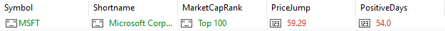
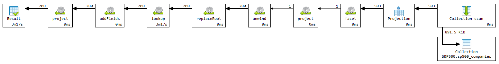
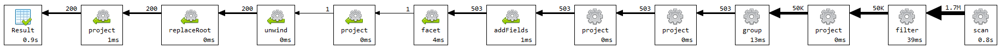
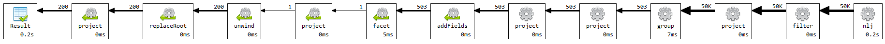

# Upit 5 - Izračunati koliki skok vrednosti cena akcija su imale kompanije tokom 2024. godine i zatim top 30 kompanija razvrstati prema industrijama, i predstaviti broj kompanija po industriji.

## Izvršavanje upita

```
db.sp500_companies.aggregate([
    {
        $facet: {
            "topMarketCap": [
                { $sort: { "Marketcap": -1 } },
                { $limit: 100 },
                { $project: { Symbol: 1, Shortname: 1, marketCapRank: { $literal: "Top 100" } } }
            ],
            "bottomMarketCap": [
                { $sort: { "Marketcap": 1 } },
                { $limit: 100 }, 
                { $project: { Symbol: 1, Shortname: 1, marketCapRank: { $literal: "Bottom 100" } } }
            ]
        }
    },
    {
        $project: {
            combined: { $concatArrays: ["$topMarketCap", "$bottomMarketCap"] }
        }
    },
    {
        $unwind: "$combined"
    },
    {
        $replaceRoot: { newRoot: "$combined" }
    },
    {
        $lookup: {
            from: "sp500_stocks",
            let: { symbol: "$Symbol" },
            pipeline: [
                {
                    $match: {
                        $expr: {
                            $and: [
                                {
                                    $gte: [
                                        "$Date",
                                        {
                                            $dateFromString: {
                                                dateString: "2024-01-01T00:00Z"
                                            }
                                        }
                                    ]
                                },
                                {
                                    $lte: [
                                        "$Date",
                                        {
                                            $dateFromString: {
                                                dateString: "2024-05-24T23:59Z"
                                            }
                                        }
                                    ]
                                },
                                {
                                    $eq: [
                                        "$Symbol",
                                        "$$symbol"
                                    ]
                                }
                            ]
                        }
                    }
                },
                {
                    $group: {
                        _id: null,
                        firstPrice: { $first: "$Close" },
                        lastPrice: { $last: "$Close" },
                        positiveDays: { $sum: { $cond: [{ $gt: ["$Close", "$Open"] }, 1, 0] } }
                    }
                },
                {
                    $project: {
                        priceJump: { $subtract: ["$lastPrice", "$firstPrice"] },
                        positiveDays: "$positiveDays",
                        _id: 0 
                    }
                }
            ],
            as: "stockPerformance"
        }
    },
    {
        $unwind: {
            path: "$stockPerformance",
            preserveNullAndEmptyArrays: true
        }
    },
    {
        $addFields: {
            "priceJump": { $round: ["$stockPerformance.priceJump", 2] },
            "positiveDays": "$stockPerformance.positiveDays"
        }
    },
    {
        $project: {
            stockPerformance: 0,
            _id: 0
        }
    }
])
```

## Vreme izvršavanja upita br. 5 pre optimizacije
### Primer rezultata upita:



Koristiće se šablon proširene reference, već je odlučeno da se određenja polja iz kolekcije companies prebace u kolekciju stocks, marketcap je sigurno jedno od najvažnijih polja stoga će se i ono prebaciti.

Biće poboljšan primarno restruktuiranjem kolekcije stocks.

## Izvršavanje upita br. 5 nakon izmene šeme:
```
db.merged_stocks.aggregate([
    {
        $match: {
            $expr: {
                
                     $gte: ["$date", new Date("2024-01-01T00:00Z")] 
               
            }
        }
    },
    {
        $group: {
            _id: "$symbol",
            firstPrice: { $first: "$close" },
            lastPrice: { $last: "$close" },
            positiveDays: { $sum: { $cond: [{ $gt: ["$close", "$open"] }, 1, 0] } },
            latestMarketCap: { $last: "$marketcap" },
            shortName: { $last: "$shortname" }
        }
    },
    {
        $addFields: {
            priceJump: { $subtract: ["$lastPrice", "$firstPrice"] }
        }
    },
    {
        $facet: {
            "top100": [
                { $sort: { "latestMarketCap": -1 } },
                { $limit: 100 },
                { $addFields: { marketCapRank: "Top 100" } }
            ],
            "bottom100": [
                { $sort: { "latestMarketCap": 1 } },
                { $limit: 100 },
                { $addFields: { marketCapRank: "Bottom 100" } }
            ]
        }
    },
    {
        $project: {
            combined: { $concatArrays: ["$top100", "$bottom100"] }
        }
    },
    {
        $unwind: "$combined"
    },
    {
        $replaceRoot: { newRoot: "$combined" }
    },
    {
        $project: {
            _id: 0,
            symbol: "$_id",
            shortName: 1,
            priceJump: { $round: ["$priceJump", 2] },
            positiveDays: 1,
            marketCapRank: 1
        }
    }
]);
```
## Vreme izvršavanja upita br. 5 pre upotrebe indeksa i nakon izmene šeme
Poboljšan primarno restruktuiranjem kolekcije stocks.



## Vreme izvršavanja upita br. 5 nakon upotrebe indeksa i nakon izmene šeme


Sa dodavanjem indeksa nad poljem date vreme se skrati, razlog za to je sužavanja skupa dokumenata značajno zbog prirode uslova.
